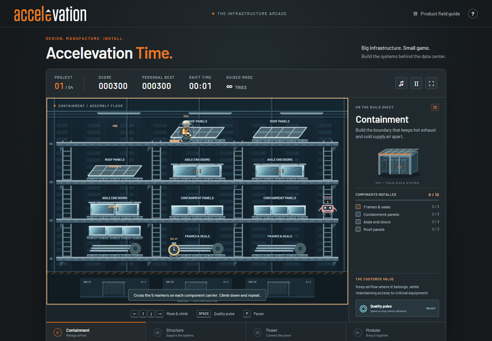

# Accelevation Time

**Build the infrastructure behind the data center.** A small, branded browser arcade game for Accelevation onboarding, office breaks, and sales conversations.

**[Play Accelevation Time](https://bullockjjb.github.io/burgertime/)**

**[Download the single HTML file](https://github.com/bullockjjb/burgertime/releases/latest/download/Accelevation-Time.html)** — the complete game in one portable file, ready to share with office testers.



Choose a female or male builder, cross component carriers, climb between assembly floors, trigger chain reactions, and deliver three complete bays per project. Both builders have identical gameplay. Version 1.1 adds detailed vector crew artwork, recognizable physical components, redesigned setbacks, and rendering that adapts to high-density screens and browser zoom.

## Four projects

1. **Containment** — frames and seals, containment panels, aisle doors, and roofs.
2. **SkyBridge™ structure** — posts, connections, support arms, and structural beams.
3. **Power distribution** — RPP enclosure, panel and breakers, branch circuit whips, and identification.
4. **Modular integration** — frame, mounts, cable conveyance, and cooling manifold.

Every project includes a customer-value takeaway and an optional knowledge question. The product field guide is always available and pauses an active shift.

## Play

| Control                               | Action                                               |
| ------------------------------------- | ---------------------------------------------------- |
| Arrow keys or W A S D                 | Move; up/down climbs one floor on an aligned ladder  |
| Space                                 | Quality pulse: hold nearby setbacks for four seconds |
| P or Escape                           | Pause / resume                                       |
| On-screen direction and pulse buttons | Touch controls on phones and tablets                 |

Cross **all five markers** on a component carrier to drop it one floor. It drops the component below it, creating a chain reaction. Sweep the next floor to keep the assembly moving toward the bays. Avoid rework bots, delays, and heat, or clear them with falling components. Release up/down between floors to climb again.

- **Guided:** unlimited tries, slower setbacks, six-second pulse recharge.
- **Arcade:** three lives, faster setbacks, nine-second pulse recharge; each completed project restores one life, up to three.
- **Scoring:** 50 × chain depth per drop; 200 per installed layer; 150 per cleared setback; 1,000 per completed project; 500 per correct knowledge answer. A collision deducts 150 points, with a zero floor.
- Personal bests are stored separately by mode **on the current browser**. No shared leaderboard, sign-in, tracking, or production-system connection.
- Sound starts muted. Motion can be reduced in **How to play**. Switching tabs pauses automatically.

## Offline use

Download **Accelevation-Time.html** from [Releases](https://github.com/bullockjjb/burgertime/releases) and open it in Edge or Chrome. That one file contains everything; no folder, extraction, installation, server, or connection is needed. Move or rename it freely.

For SharePoint, upload the HTML to your document library and ask testers to **download and open** it. SharePoint Online normally previews or downloads HTML rather than executing the game within the library. For immediate browser play, add the live game URL to a SharePoint Quick Links tile. See the [office distribution guide](docs/SHAREPOINT.md) for instructions and Microsoft references.

The conventional browser ZIP remains available too: extract it and open `index.html` with its adjacent assets. The full source ZIP works the same way.

All fonts, logos, scripts, and styling are bundled. Playing requires no network connection. Links in the product field guide open the company website only when selected. A modern browser with Canvas and JavaScript is required; this is a visual action game, not a screen-reader-playable game. The field guide and surrounding controls use semantic HTML and support keyboard navigation.

## Development

No package installation is required. Use Node.js 20.11+ or 22+:

```sh
npm run dev    # http://127.0.0.1:4173
npm test       # deterministic game simulation tests
npm run build # static, self-contained dist/ output
```

- `js/catalog.js`: product names, component descriptions, knowledge checks, and source links.
- `js/engine.js`: deterministic movement, ladders, component cascades, setbacks, scoring, and run progression.
- `js/render.js`: original Canvas artwork and product illustrations.
- `js/art.js`: detailed builders, component silhouettes, setbacks, and high-density canvas sizing.
- `js/app.js`: interface, input, audio, dialogs, and browser preferences.
- `styles.css`: brand fonts, palette, layout, responsive and accessibility preferences.
- `scripts/standalone.mjs`: reproducible single-HTML bundling, including embedded fonts, logos, scripts, and license notices.

The GitHub Actions workflow tests and builds every change, then deploys successful `master` updates to GitHub Pages. Configure Pages to use **GitHub Actions**. The static build uses an explicit public-file allowlist and does not publish the legacy desktop game's artwork/audio or internal company documents.

See [product sources and content boundaries](docs/CONTENT-SOURCES.md), [validation notes](docs/VALIDATION.md), and [credits](docs/CREDITS.md).

## Original desktop clone

The original C++/SFML clone remains in `src/`, `include/`, `maps/`, `img/`, `audio/`, and `resources/`, with its `makefile`. Its [original README](docs/ORIGINAL-README.md) is preserved. No legacy artwork or audio is loaded by the browser edition.

Code is licensed under [GPL v3](LICENSE), or later where indicated. Barlow has its bundled SIL Open Font License. Company logos and trademarks remain the property of their respective owner.
